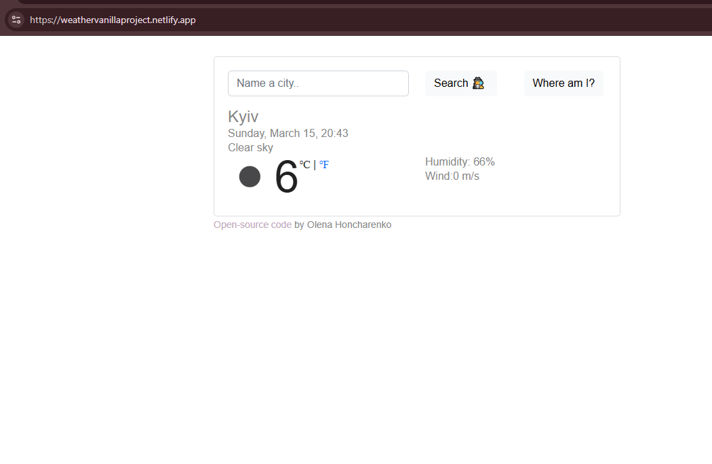

# 🌦 Weather App

A simple weather application built with **vanilla JavaScript** that allows users to search for real-time weather information for any city.

The project demonstrates **API integration, dynamic UI updates, responsive design**, and the ability to detect the user's location to display local weather automatically.

---

## 🚀 Live Demo

[View Live Demo](https://weathervanillaproject.netlify.app/)

---

## 💻 Technologies Used

- JavaScript (ES6)
- HTML5
- CSS3
- REST API
- Fetch API
- Geolocation API

---

## ✨ Features

- Search weather by city name
- Display weather based on the user's current location
- Temperature display in **Celsius (°C) and Fahrenheit (°F)**
- Real-time weather data
- Dynamic content rendering
- Responsive design for different screen sizes
- Simple and intuitive user interface

---

## 📡 API Integration

This project uses a public **weather API** to fetch current weather data.

Data retrieved includes:

- Temperature
- Weather conditions
- Wind speed
- Humidity

The data is fetched using **Fetch API** and dynamically rendered in the DOM.

The application can also use the **Geolocation API** to detect the user's current location and display the local weather automatically.

---

## 📷 App Preview

---

## 📚 What I Learned

Through this project I practiced:

- Working with external APIs
- Handling asynchronous JavaScript with Fetch API
- Using the Geolocation API
- Rendering dynamic UI elements
- Improving responsive layout with CSS Flexbox

---

## 🔧 Possible Improvements

Future improvements could include:

- 5-day weather forecast
- Improved UI animations
- Dark mode support
- Error handling for invalid city input

---

## 👩 Author

Olena Honcharenko  
Junior Software Developer  

[GitHub](https://github.com/PuhnastaO)  
[LinkedIn](https://www.linkedin.com/in/olena-honcharenko-115069234/)

